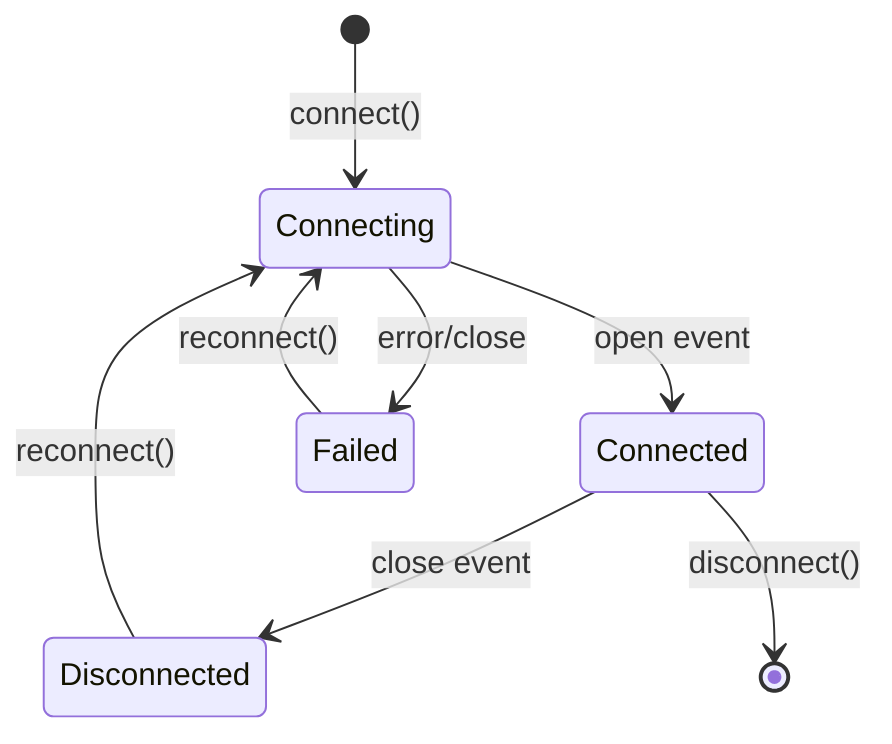

# WebSocket Connection

Learn how to establish, maintain, and handle WebSocket connections to the Cossistant API.

## Connection URL

```
wss://api.cossistant.com/ws
```

## Authentication Methods

### Method 1: Public API Key (Visitors)

Best for browser-based chat widgets:

```javascript
const publicKey = 'pk_test_abc123...';
const visitorId = '01JG000000000000000000000';

const ws = new WebSocket(
  `wss://api.cossistant.com/ws?publicKey=${publicKey}&visitorId=${visitorId}`
);
```

### Method 2: Private API Key (Server-Side)

For server integrations:

```javascript
const privateKey = 'sk_test_xyz789...';

const ws = new WebSocket(
  `wss://api.cossistant.com/ws?token=${privateKey}`
);
```

### Method 3: Session Token (Dashboard)

For authenticated dashboard users:

```javascript
const sessionToken = 'sess_abc123...';
const websiteId = '01JG000000000000000000001';

const ws = new WebSocket(
  `wss://api.cossistant.com/ws?sessionToken=${sessionToken}&websiteId=${websiteId}`
);
```

## Complete Connection Example

```javascript
class CossistantWebSocket {
  constructor(publicKey, visitorId) {
    this.publicKey = publicKey;
    this.visitorId = visitorId;
    this.ws = null;
    this.reconnectAttempts = 0;
    this.maxReconnectDelay = 30000;
    this.handlers = new Map();
  }
  
  connect() {
    const url = `wss://api.cossistant.com/ws?publicKey=${this.publicKey}&visitorId=${this.visitorId}`;
    this.ws = new WebSocket(url);
    
    this.ws.addEventListener('open', this.handleOpen.bind(this));
    this.ws.addEventListener('message', this.handleMessage.bind(this));
    this.ws.addEventListener('close', this.handleClose.bind(this));
    this.ws.addEventListener('error', this.handleError.bind(this));
    
    return this;
  }
  
  handleOpen() {
    console.log('WebSocket connected');
    this.reconnectAttempts = 0;
    
    // Start heartbeat
    this.startHeartbeat();
  }
  
  handleMessage(event) {
    if (event.data === 'pong') {
      return; // Heartbeat response
    }
    
    try {
      const data = JSON.parse(event.data);
      
      if (data.type === 'connection_established') {
        console.log('Connection established:', data.connectionId);
        return;
      }
      
      // Dispatch to event handlers
      const handlers = this.handlers.get(data.type) || [];
      handlers.forEach(handler => handler(data.payload));
      
    } catch (error) {
      console.error('Failed to parse message:', error);
    }
  }
  
  handleClose(event) {
    console.log('WebSocket closed:', event.code, event.reason);
    this.stopHeartbeat();
    
    // Attempt reconnection with exponential backoff
    if (event.code !== 1008) { // Don't reconnect on auth failure
      this.reconnect();
    }
  }
  
  handleError(error) {
    console.error('WebSocket error:', error);
  }
  
  reconnect() {
    const delay = Math.min(
      1000 * Math.pow(2, this.reconnectAttempts),
      this.maxReconnectDelay
    );
    
    this.reconnectAttempts++;
    
    console.log(`Reconnecting in ${delay}ms (attempt ${this.reconnectAttempts})...`);
    
    setTimeout(() => {
      this.connect();
    }, delay);
  }
  
  startHeartbeat() {
    this.heartbeatInterval = setInterval(() => {
      if (this.ws?.readyState === WebSocket.OPEN) {
        this.ws.send('ping');
      }
    }, 30000); // Every 30 seconds
  }
  
  stopHeartbeat() {
    if (this.heartbeatInterval) {
      clearInterval(this.heartbeatInterval);
      this.heartbeatInterval = null;
    }
  }
  
  on(eventType, handler) {
    if (!this.handlers.has(eventType)) {
      this.handlers.set(eventType, []);
    }
    this.handlers.get(eventType).push(handler);
    
    return () => this.off(eventType, handler);
  }
  
  off(eventType, handler) {
    const handlers = this.handlers.get(eventType);
    if (handlers) {
      const index = handlers.indexOf(handler);
      if (index > -1) {
        handlers.splice(index, 1);
      }
    }
  }
  
  send(event) {
    if (this.ws?.readyState === WebSocket.OPEN) {
      this.ws.send(JSON.stringify(event));
    } else {
      console.warn('WebSocket not open, cannot send event');
    }
  }
  
  disconnect() {
    this.stopHeartbeat();
    if (this.ws) {
      this.ws.close();
      this.ws = null;
    }
  }
}

// Usage
const socket = new CossistantWebSocket('pk_test_abc...', '01JG000000000000000000000');
socket.connect();

// Listen for messages
socket.on('timelineItemCreated', (payload) => {
  console.log('New message:', payload.item);
});

// Send typing indicator
socket.send({
  type: 'conversationTyping',
  payload: {
    conversationId: '01JG123456789ABCDEFGHIJK',
    isTyping: true
  }
});
```

## Connection Lifecycle



## Handling Connection States

```javascript
const ConnectionState = {
  CONNECTING: 0,
  OPEN: 1,
  CLOSING: 2,
  CLOSED: 3
};

function getConnectionState(ws) {
  if (!ws) return 'Not initialized';
  
  switch (ws.readyState) {
    case ConnectionState.CONNECTING:
      return 'Connecting...';
    case ConnectionState.OPEN:
      return 'Connected';
    case ConnectionState.CLOSING:
      return 'Closing...';
    case ConnectionState.CLOSED:
      return 'Disconnected';
    default:
      return 'Unknown';
  }
}

// Update UI based on state
ws.addEventListener('open', () => {
  document.getElementById('status').textContent = 'Connected';
  document.getElementById('status').className = 'connected';
});

ws.addEventListener('close', () => {
  document.getElementById('status').textContent = 'Disconnected';
  document.getElementById('status').className = 'disconnected';
});
```

## Heartbeat / Keep-Alive

Send periodic pings to keep the connection alive and detect disconnections:

```javascript
let heartbeatInterval;
let missedPongs = 0;
const MAX_MISSED_PONGS = 3;

function startHeartbeat(ws) {
  heartbeatInterval = setInterval(() => {
    if (ws.readyState === WebSocket.OPEN) {
      ws.send('ping');
      missedPongs++;
      
      if (missedPongs >= MAX_MISSED_PONGS) {
        console.warn('Connection appears dead, reconnecting...');
        ws.close();
      }
    }
  }, 30000);
}

ws.addEventListener('message', (event) => {
  if (event.data === 'pong') {
    missedPongs = 0; // Reset counter
  }
});

function stopHeartbeat() {
  if (heartbeatInterval) {
    clearInterval(heartbeatInterval);
    heartbeatInterval = null;
  }
}
```

## Presence Updates

Update presence while keeping the connection alive:

```javascript
function sendPresencePing(ws) {
  if (ws.readyState === WebSocket.OPEN) {
    ws.send('presence:ping');
    // Server updates lastSeenAt and responds with 'pong'
  }
}

// Send presence every minute
setInterval(() => sendPresencePing(ws), 60000);
```

## Error Handling

### Authentication Failures

```javascript
ws.addEventListener('close', (event) => {
  if (event.code === 1008) {
    console.error('Authentication failed:', event.reason);
    // Don't attempt reconnection
    showAuthError('Invalid API key or visitor ID');
  }
});

ws.addEventListener('message', (event) => {
  try {
    const data = JSON.parse(event.data);
    
    if (data.error) {
      console.error('Server error:', data.error, data.message);
      
      switch (data.error) {
        case 'Authentication failed':
          // Invalid credentials
          break;
        case 'Unauthorized':
          // Trying to access forbidden resource
          break;
        case 'Invalid event type':
          // Sent unsupported event
          break;
      }
    }
  } catch (e) {
    // Not JSON, ignore
  }
});
```

### Network Errors

```javascript
ws.addEventListener('error', (error) => {
  console.error('WebSocket error:', error);
  // The close event will fire after this
});

ws.addEventListener('close', (event) => {
  if (event.code === 1006) {
    console.error('Connection closed abnormally (network issue)');
    // Attempt reconnection with backoff
  }
});
```

## Reconnection Strategy

### Exponential Backoff

```javascript
class ReconnectManager {
  constructor(connect) {
    this.connect = connect;
    this.attempts = 0;
    this.maxAttempts = 10;
    this.baseDelay = 1000;
    this.maxDelay = 30000;
  }
  
  scheduleReconnect() {
    if (this.attempts >= this.maxAttempts) {
      console.error('Max reconnection attempts reached');
      return;
    }
    
    const delay = Math.min(
      this.baseDelay * Math.pow(2, this.attempts),
      this.maxDelay
    );
    
    // Add jitter (±25%)
    const jitter = delay * 0.25 * (Math.random() * 2 - 1);
    const finalDelay = delay + jitter;
    
    console.log(`Reconnecting in ${Math.round(finalDelay)}ms...`);
    
    this.attempts++;
    
    setTimeout(() => {
      this.connect();
    }, finalDelay);
  }
  
  reset() {
    this.attempts = 0;
  }
}

// Usage
const reconnector = new ReconnectManager(() => {
  ws = createWebSocket();
});

ws.addEventListener('open', () => {
  reconnector.reset();
});

ws.addEventListener('close', (event) => {
  if (event.code !== 1008) { // Not auth failure
    reconnector.scheduleReconnect();
  }
});
```

### Visibility-Based Reconnection

Reconnect when the page becomes visible:

```javascript
document.addEventListener('visibilitychange', () => {
  if (document.visibilityState === 'visible') {
    if (!ws || ws.readyState === WebSocket.CLOSED) {
      console.log('Page visible, reconnecting...');
      connect();
    }
  }
});
```

## Browser Compatibility

WebSocket is supported in:
- Chrome 16+
- Firefox 11+
- Safari 7+
- Edge (all versions)
- iOS Safari 7.1+
- Android WebView 4.4+

Check support:

```javascript
if ('WebSocket' in window) {
  // WebSocket is supported
  const ws = new WebSocket(url);
} else {
  // Fallback to long-polling or show error
  console.error('WebSocket not supported');
}
```

## Testing Connections

Test connectivity:

```javascript
async function testWebSocketConnection(url) {
  return new Promise((resolve, reject) => {
    const ws = new WebSocket(url);
    const timeout = setTimeout(() => {
      ws.close();
      reject(new Error('Connection timeout'));
    }, 5000);
    
    ws.addEventListener('open', () => {
      clearTimeout(timeout);
      ws.close();
      resolve(true);
    });
    
    ws.addEventListener('error', (error) => {
      clearTimeout(timeout);
      reject(error);
    });
  });
}

// Usage
try {
  await testWebSocketConnection('wss://api.cossistant.com/ws?publicKey=...');
  console.log('Connection successful');
} catch (error) {
  console.error('Connection failed:', error);
}
```

## Next Steps

<CardGroup cols={2}>
  <Card title="WebSocket Events" icon="list" href="/api/websocket/events">
    See all available events
  </Card>
  
  <Card title="React Hook" icon="react" href="/api/hooks/use-realtime-support">
    Use WebSocket in React
  </Card>
</CardGroup>
