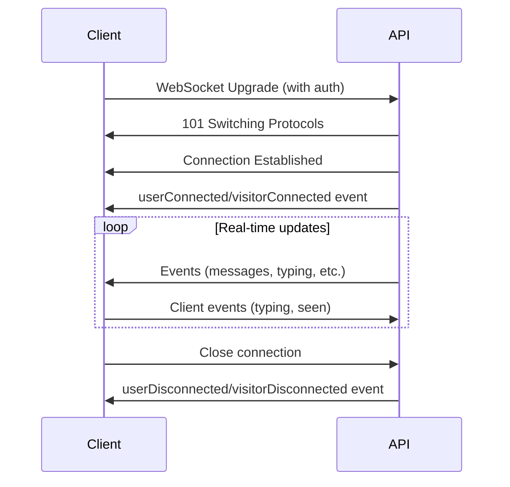

# WebSocket API Overview

The WebSocket API provides real-time, bidirectional communication for live updates on conversations, messages, typing indicators, and AI agent processing.

## WebSocket URL

```
wss://api.cossistant.com/ws
```

## Why Use WebSockets?

WebSockets enable:

<CardGroup cols={2}>
  <Card title="Real-Time Updates" icon="bolt">
    Receive instant notifications when messages arrive, without polling
  </Card>
  
  <Card title="Typing Indicators" icon="keyboard">
    Show when visitors or team members are typing
  </Card>
  
  <Card title="Presence Tracking" icon="circle-dot">
    See who's online and when they were last active
  </Card>
  
  <Card title="AI Processing Events" icon="robot">
    Stream AI agent decisions and responses in real-time
  </Card>
</CardGroup>

## Connection Flow



## Authentication

WebSocket connections support the same authentication methods as REST API:

### Public API Key (for visitors)

```javascript
const ws = new WebSocket(
  'wss://api.cossistant.com/ws?publicKey=pk_test_abc123...&visitorId=01JG000000000000000000000'
);
```

### Private API Key (for users)

```javascript
const ws = new WebSocket(
  'wss://api.cossistant.com/ws?token=sk_test_xyz789...'
);
```

### Session Token (dashboard users)

```javascript
const ws = new WebSocket(
  'wss://api.cossistant.com/ws?sessionToken=sess_abc123...&websiteId=01JG000000000000000000001'
);
```

<Note>
Browsers cannot set custom headers on WebSocket connections, so authentication must be provided via query parameters.
</Note>

## Connection Establishment

When the WebSocket connection is established, you'll receive a connection confirmation:

```json
{
  "type": "connection_established",
  "connectionId": "conn_1234567890_abc",
  "websiteId": "01JG000000000000000000001",
  "visitorId": "01JG000000000000000000000",
  "userId": null
}
```

## Heartbeat / Keep-Alive

Send periodic ping messages to keep the connection alive:

```javascript
// Send ping every 30 seconds
setInterval(() => {
  if (ws.readyState === WebSocket.OPEN) {
    ws.send('ping');
  }
}, 30000);

// Listen for pong
ws.addEventListener('message', (event) => {
  if (event.data === 'pong') {
    console.log('Connection alive');
  }
});
```

### Presence Ping

To update presence while keeping the connection alive:

```javascript
ws.send('presence:ping');
// API responds with 'pong' and updates lastSeenAt
```

## Event Format

All events follow this structure:

```json
{
  "type": "eventType",
  "payload": {
    // Event-specific data
  }
}
```

## Event Categories

### Connection Events

- `userConnected`: Dashboard user connected
- `userDisconnected`: Dashboard user disconnected
- `visitorConnected`: Visitor connected
- `visitorDisconnected`: Visitor disconnected
- `userPresenceUpdate`: User's last seen timestamp updated

### Conversation Events

- `conversationCreated`: New conversation created
- `conversationUpdated`: Conversation metadata changed
- `conversationSeen`: Someone read messages
- `conversationTyping`: Someone is typing

### Message Events

- `timelineItemCreated`: New message or event
- `timelineItemUpdated`: Message edited
- `timelineItemPartUpdated`: Streaming message part updated

### AI Agent Events

- `aiAgentProcessingStarted`: AI started processing
- `aiAgentDecisionMade`: AI decided whether to respond
- `aiAgentProcessingProgress`: AI is generating response
- `aiAgentProcessingCompleted`: AI finished responding

See [WebSocket Events](/api/websocket/events) for complete event reference.

## Example: Basic Connection

```javascript
const ws = new WebSocket(
  'wss://api.cossistant.com/ws?publicKey=pk_test_abc123...&visitorId=01JG000000000000000000000'
);

ws.addEventListener('open', () => {
  console.log('WebSocket connected');
});

ws.addEventListener('message', (event) => {
  const data = JSON.parse(event.data);
  console.log('Received event:', data.type, data.payload);
  
  switch (data.type) {
    case 'timelineItemCreated':
      // New message received
      displayMessage(data.payload.item);
      break;
      
    case 'conversationTyping':
      // Show typing indicator
      showTyping(data.payload.isTyping);
      break;
  }
});

ws.addEventListener('close', () => {
  console.log('WebSocket disconnected');
});

ws.addEventListener('error', (error) => {
  console.error('WebSocket error:', error);
});
```

## Example: Sending Events

Clients can send typing and seen events:

```javascript
// Send typing indicator
ws.send(JSON.stringify({
  type: 'conversationTyping',
  payload: {
    conversationId: '01JG123456789ABCDEFGHIJK',
    isTyping: true,
    visitorPreview: 'Hello, I need help with...'
  }
}));

// Mark conversation as seen
ws.send(JSON.stringify({
  type: 'conversationSeen',
  payload: {
    conversationId: '01JG123456789ABCDEFGHIJK'
  }
}));
```

<Warning>
Clients can only send `conversationTyping` and `conversationSeen` events. All other events are server-initiated only.
</Warning>

## Reconnection Strategy

Implement exponential backoff for reconnections:

```javascript
let reconnectDelay = 1000; // Start with 1 second
const maxDelay = 30000; // Max 30 seconds

function connect() {
  const ws = new WebSocket(url);
  
  ws.addEventListener('open', () => {
    reconnectDelay = 1000; // Reset on successful connection
  });
  
  ws.addEventListener('close', () => {
    console.log(`Reconnecting in ${reconnectDelay}ms...`);
    
    setTimeout(() => {
      reconnectDelay = Math.min(reconnectDelay * 2, maxDelay);
      connect();
    }, reconnectDelay);
  });
  
  return ws;
}

const ws = connect();
```

## Rate Limiting

WebSocket **connection attempts** are rate limited:

| Environment | Limit |
|-------------|-------|
| Development | 30 connections per minute |
| Production | 10 connections per minute |

Once connected:
- Messages are **not** rate limited
- Connections can stay open indefinitely
- Send as many events as needed

## Error Handling

### Authentication Errors

Connection closes with code `1008` (Policy Violation):

```javascript
ws.addEventListener('close', (event) => {
  if (event.code === 1008) {
    console.error('Authentication failed:', event.reason);
    // Don't retry - fix authentication
  }
});
```

### Invalid Events

Server sends error message:

```json
{
  "error": "Invalid event type",
  "message": "Event type 'invalidType' cannot be sent by clients"
}
```

### Authorization Errors

For events that require specific permissions:

```json
{
  "error": "Unauthorized",
  "message": "You can only send typing events for your own conversations"
}
```

## Browser Support

WebSockets are supported in all modern browsers:

- Chrome 16+
- Firefox 11+
- Safari 7+
- Edge (all versions)
- iOS Safari 7.1+
- Chrome for Android

For older browsers, consider using a fallback like long-polling.

## Next Steps

<CardGroup cols={3}>
  <Card title="Event Reference" icon="list" href="/api/websocket/events">
    Complete list of WebSocket events
  </Card>
  
  <Card title="Connection Guide" icon="plug" href="/api/websocket/connection">
    Detailed connection setup
  </Card>
  
  <Card title="React Hook" icon="react" href="/api/hooks/use-realtime-support">
    useRealtimeSupport hook
  </Card>
</CardGroup>
