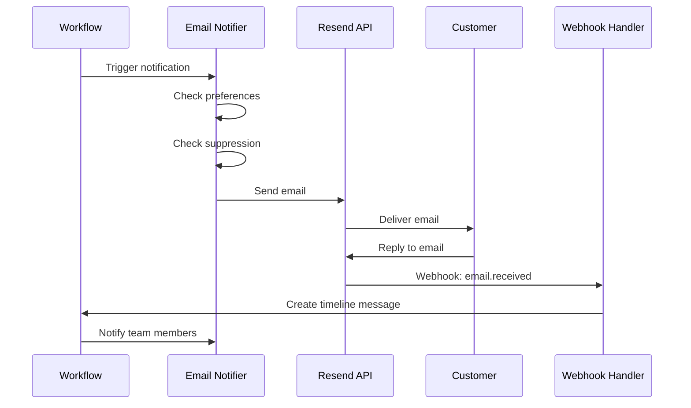

Cossistant's email integration provides a complete solution for sending conversation notifications via email. Built on Resend, it includes advanced features like email threading, bounce tracking, and automatic reply processing.

## Overview

The email integration handles:

- **Outbound emails**: Notifications to team members and visitors
- **Email threading**: Proper conversation grouping in email clients
- **Bounce management**: Automatic suppression of bounced/complained emails
- **Inbound replies**: Convert email responses to conversation messages
- **Idempotency**: Prevent duplicate email sends on retries

## Architecture



## Sending Emails

### Basic Email Send

Use the `sendEmail` function from the transactional package:

```typescript
import { sendEmail } from "@cossistant/transactional";

await sendEmail(
  {
    to: "user@example.com",
    subject: "New message in your conversation",
    react: <EmailTemplate />,
    variant: "notifications",
  },
  { idempotencyKey: "unique-key" }
);
```

<ParamField path="to" type="string | string[]" required>
  Recipient email address(es)
</ParamField>

<ParamField path="subject" type="string" required>
  Email subject line
</ParamField>

<ParamField path="react" type="ReactElement" required>
  React component to render as email body
</ParamField>

<ParamField path="variant" type="'notifications' | 'marketing'" default="notifications">
  Email type - affects From address and headers
</ParamField>

<ParamField path="replyTo" type="string | 'noreply'">
  Reply-to address. Use `'noreply'` to omit the header entirely.
</ParamField>

<ParamField path="headers" type="Record<string, string>">
  Custom email headers (e.g., for threading)
</ParamField>

<ParamField path="tags" type="Array<{name: string, value: string}>">
  Metadata tags for tracking and filtering
</ParamField>

### Email with Threading

For conversation emails, use threading headers to group messages:

<CodeGroup>
```typescript Send Threaded Email
import { 
  sendEmail,
  generateThreadingHeaders,
  generateInboundReplyAddress 
} from "@cossistant/transactional";

const threadingHeaders = generateThreadingHeaders({
  conversationId: "01ABCD1234EFGH5678IJKL9012",
  messageId: "01WXYZ9876MNOP5432QRST1234", // optional
});

const replyToAddress = generateInboundReplyAddress({
  conversationId: "01ABCD1234EFGH5678IJKL9012",
});

await sendEmail({
  to: recipient.email,
  replyTo: replyToAddress,
  subject: "New message from Example Website",
  react: <NewMessageInConversation {...props} />,
  variant: "notifications",
  headers: threadingHeaders,
});
```

```typescript Threading Headers Output
{
  "In-Reply-To": "<conv-01ABCD1234EFGH5678IJKL9012@cossistant.com>",
  "References": "<conv-01ABCD1234EFGH5678IJKL9012@cossistant.com>",
  "Message-ID": "<msg-01WXYZ9876MNOP5432QRST1234@cossistant.com>"
}
```

```typescript Reply-To Address
// Production
"conv-01ABCD1234EFGH5678IJKL9012@inbound.cossistant.com"

// Development
"test-conv-01ABCD1234EFGH5678IJKL9012@inbound.cossistant.com"
```
</CodeGroup>

<Info>
Threading headers ensure emails appear as a single conversation thread in Gmail, Outlook, and other email clients.
</Info>

### Batch Email Send

Send multiple emails efficiently with batch sending:

```typescript
import { sendBatchEmail } from "@cossistant/transactional";

await sendBatchEmail(
  [
    {
      to: "user1@example.com",
      subject: "New message",
      react: <EmailTemplate name="User 1" />,
    },
    {
      to: "user2@example.com",
      subject: "New message",
      react: <EmailTemplate name="User 2" />,
    },
  ],
  { idempotencyKey: "batch-key" }
);
```

<Warning>
Batch sends count as a single API call but create multiple individual emails. Each email can still fail independently.
</Warning>

## Notification Workflows

Cossistant uses workflows to orchestrate email notifications based on conversation events.

### Member Notification Workflow

When a visitor or AI sends a message, team members receive email notifications:

<CodeGroup>
```typescript Member Email Notifier
export async function sendMemberEmailNotification(
  params: SendMemberEmailParams
): Promise<void> {
  const { db, recipient, conversationId, organizationId } = params;

  // 1. Check notification preferences
  const preference = await getMemberNotificationPreference(db, {
    memberId: recipient.memberId,
    organizationId,
  });

  if (preference !== undefined && !preference.enabled) {
    return; // User disabled email notifications
  }

  // 2. Fetch unseen messages
  const { messages, totalCount } = await getMessagesForEmail(db, {
    conversationId,
    organizationId,
    recipientUserId: recipient.userId,
    maxMessages: MAX_MESSAGES_IN_EMAIL,
    earliestCreatedAt: workflowState.initialMessageCreatedAt,
  });

  if (messages.length === 0) {
    return; // No new messages to send
  }

  // 3. Check suppression status
  const isSuppressed = await isEmailSuppressed(db, {
    email: recipient.email,
    organizationId,
  });

  if (isSuppressed) {
    logEmailSuppressed({ email: recipient.email, /* ... */ });
    return;
  }

  // 4. Generate threading headers
  const threadingHeaders = generateThreadingHeaders({
    conversationId,
  });

  // 5. Generate idempotency key
  const idempotencyKey = generateEmailIdempotencyKey({
    conversationId,
    recipientEmail: recipient.email,
    timestamp: new Date(workflowState.initialMessageCreatedAt).getTime(),
  });

  // 6. Send email
  await sendEmail(
    {
      to: recipient.email,
      replyTo: generateInboundReplyAddress({ conversationId }),
      subject:
        totalCount > 1
          ? `${totalCount} new messages from ${websiteInfo.name}`
          : `New message from ${websiteInfo.name}`,
      react: (
        <NewMessageInConversation
          conversationId={conversationId}
          messages={messages}
          totalCount={totalCount}
          website={websiteInfo}
        />
      ),
      variant: "notifications",
      headers: threadingHeaders,
    },
    { idempotencyKey }
  );

  logEmailSent({ email: recipient.email, conversationId, organizationId });
}
```

```typescript Workflow Configuration
export const WORKFLOW = {
  MEMBER_SENT_MESSAGE: "message/member-sent-message",
  VISITOR_SENT_MESSAGE: "message/visitor-sent-message",
  AI_AGENT_RESPONSE: "ai-agent/respond",
} as const;
```
</CodeGroup>

### Visitor Notification Workflow

When team members or AI respond, visitors receive email notifications:

```typescript
export async function sendVisitorEmailNotification(
  params: SendVisitorEmailParams
): Promise<void> {
  const { db, recipient, conversationId, organizationId } = params;

  // Visitors always receive emails (no preference check)
  
  const { messages, totalCount } = await getMessagesForEmail(db, {
    conversationId,
    organizationId,
    recipientVisitorId: recipient.visitorId,
    maxMessages: MAX_MESSAGES_IN_EMAIL,
    earliestCreatedAt: workflowState.initialMessageCreatedAt,
  });

  if (messages.length === 0) return;

  // Check suppression
  const isSuppressed = await isEmailSuppressed(db, {
    email: recipient.email,
    organizationId,
  });

  if (isSuppressed) {
    logEmailSuppressed({ /* ... */ });
    return;
  }

  await sendEmail(
    {
      to: recipient.email,
      replyTo: generateInboundReplyAddress({ conversationId }),
      subject: `New message from ${websiteInfo.name}`,
      react: <NewMessageInConversation isReceiverVisitor={true} {...props} />,
      variant: "notifications",
      headers: generateThreadingHeaders({ conversationId }),
    },
    { idempotencyKey: generateEmailIdempotencyKey({ /* ... */ }) }
  );
}
```

<Info>
Visitors don't have explicit notification preferences - they always receive emails unless their address is suppressed.
</Info>

## Email Threading

### How Threading Works

Email threading uses special headers to link related messages:

<Steps>
  <Step title="Message-ID">
    Each email gets a unique identifier:
    ```
    Message-ID: <msg-01WXYZ9876@cossistant.com>
    ```
  </Step>

  <Step title="In-Reply-To">
    Points to the conversation thread:
    ```
    In-Reply-To: <conv-01ABCD1234@cossistant.com>
    ```
  </Step>

  <Step title="References">
    Maintains the complete thread chain:
    ```
    References: <conv-01ABCD1234@cossistant.com>
    ```
  </Step>

  <Step title="Reply-To">
    Inbound address for processing replies:
    ```
    Reply-To: conv-01ABCD1234@inbound.cossistant.com
    ```
  </Step>
</Steps>

### Threading Utilities

<CodeGroup>
```typescript Generate Message ID
import { generateMessageId } from "@api/utils/email-threading";

const messageId = generateMessageId("01WXYZ9876MNOP5432QRST1234");
// Result: "<msg-01WXYZ9876MNOP5432QRST1234@cossistant.com>"
```

```typescript Generate Thread ID
import { generateConversationThreadId } from "@api/utils/email-threading";

const threadId = generateConversationThreadId("01ABCD1234EFGH5678IJKL9012");
// Result: "<conv-01ABCD1234EFGH5678IJKL9012@cossistant.com>"
```

```typescript Generate Reply Address
import { generateInboundReplyAddress } from "@api/utils/email-threading";

// Production
const prodAddress = generateInboundReplyAddress({
  conversationId: "01ABCD1234EFGH5678IJKL9012",
});
// Result: "conv-01ABCD1234EFGH5678IJKL9012@inbound.cossistant.com"

// Development (when NODE_ENV !== "production")
// Result: "test-conv-01ABCD1234EFGH5678IJKL9012@inbound.cossistant.com"
```

```typescript Parse Reply Address
import { parseInboundReplyAddress } from "@api/utils/email-threading";

const parsed = parseInboundReplyAddress(
  "conv-01ABCD1234@inbound.cossistant.com"
);
// Result: {
//   conversationId: "01ABCD1234EFGH5678IJKL9012",
//   environment: "production"
// }
```
</CodeGroup>

## Bounce Management

Cossistant automatically tracks and suppresses problematic email addresses to protect sender reputation.

### Suppression Types

| Type | Trigger | Auto-Suppress | Description |
|------|---------|---------------|-------------|
| Hard Bounce | Email doesn't exist | Yes | Permanent delivery failure |
| Soft Bounce | Temporary issue | No | Mailbox full, server down |
| Complaint | Marked as spam | Yes | Recipient reported spam |
| Repeated Failure | 3+ consecutive fails | Yes | Persistent delivery issues |

### Checking Suppression Status

```typescript
import { isEmailSuppressed } from "@api/db/queries/email-bounce";

const suppressed = await isEmailSuppressed(db, {
  email: "user@example.com",
  organizationId: "01ORG123456789",
});

if (suppressed) {
  console.log("Email is suppressed - skip sending");
}
```

### Suppression Database Schema

```typescript
type EmailBounceStatus = {
  email: string;
  organizationId: string;
  bounceType?: string;          // "Permanent" | "Transient"
  bounceSubType?: string;        // "Suppressed" | "General"
  bounceMessage?: string;
  bouncedAt?: Date;
  complainedAt?: Date;
  failedAt?: Date;
  failureCount: string;          // Increments on each failure
  lastFailureReason?: string;
  suppressed: boolean;           // Whether to block sends
  suppressedReason?: string;     // "bounced" | "complained" | "failed_repeatedly"
  suppressedAt?: Date;
  lastEventId: string;           // Resend event ID
  updatedAt: Date;
};
```

### Manual Suppression Management

<Warning>
Manually unsuppressing emails should be done cautiously. Only unsuppress addresses after confirming the issue is resolved.
</Warning>

```typescript
// Unsuppress an email (use sparingly)
await db
  .update(emailBounceStatus)
  .set({
    suppressed: false,
    suppressedReason: null,
    suppressedAt: null,
    failureCount: "0",
  })
  .where(
    and(
      eq(emailBounceStatus.email, "user@example.com"),
      eq(emailBounceStatus.organizationId, organizationId)
    )
  );
```

## Idempotency

### Why Idempotency Matters

Workflows may retry on failure, which could send duplicate emails. Idempotency keys prevent this:

- **Workflow retries**: Same key = same email, sent only once
- **Network failures**: Resend deduplicates using the key
- **Race conditions**: Multiple workers won't send duplicates

### Generating Idempotency Keys

```typescript
import { generateEmailIdempotencyKey } from "@api/utils/email-threading";

const key = generateEmailIdempotencyKey({
  conversationId: "01ABCD1234EFGH5678IJKL9012",
  recipientEmail: "user@example.com",
  timestamp: 1234567890000,
});
// Result: "conv-01ABCD1234EFGH5678IJKL9012-12345-1234567890000"
```

**Key format**: `conv-{conversationId}-{emailHash}-{timestamp}`

- **conversationId**: Scopes to a specific conversation
- **emailHash**: Allows different keys per recipient
- **timestamp**: Ensures different batches get different keys

### Using Idempotency Keys

```typescript
await sendEmail(
  {
    to: "user@example.com",
    subject: "New message",
    react: <EmailTemplate />,
  },
  {
    idempotencyKey: "conv-01ABCD-12345-1234567890000",
  }
);
```

<Info>
Resend caches idempotency keys for 24 hours. After that, the same key will send a new email.
</Info>

## Email Templates

Cossistant uses React Email for email templates:

<CodeGroup>
```tsx New Message Template
import {
  Body,
  Container,
  Head,
  Heading,
  Html,
  Text,
  Button,
} from "@react-email/components";

interface NewMessageInConversationProps {
  conversationId: string;
  email: string;
  isReceiverVisitor: boolean;
  messages: Array<{
    id: string;
    text: string;
    senderName: string;
    createdAt: string;
  }>;
  totalCount: number;
  website: {
    name: string;
    slug: string;
    logo: string | null;
  };
}

export const NewMessageInConversation = ({
  conversationId,
  messages,
  totalCount,
  website,
  isReceiverVisitor,
}: NewMessageInConversationProps) => {
  const viewUrl = isReceiverVisitor
    ? `https://app.cossistant.com/c/${conversationId}`
    : `https://app.cossistant.com/${website.slug}/inbox/${conversationId}`;

  return (
    <Html>
      <Head />
      <Body style={main}>
        <Container style={container}>
          <Heading style={h1}>
            {totalCount} new {totalCount === 1 ? "message" : "messages"} from{" 
            {website.name}
          </Heading>

          {messages.map((message) => (
            <div key={message.id} style={messageBox}>
              <Text style={senderName}>{message.senderName}</Text>
              <Text style={messageText}>{message.text}</Text>
              <Text style={timestamp}>
                {new Date(message.createdAt).toLocaleString()}
              </Text>
            </div>
          ))}

          <Button href={viewUrl} style={button}>
            View Conversation
          </Button>
        </Container>
      </Body>
    </Html>
  );
};
```

```typescript Using the Template
import { NewMessageInConversation } from "@cossistant/transactional";

await sendEmail({
  to: "user@example.com",
  subject: "New message from Example Website",
  react: (
    <NewMessageInConversation
      conversationId={conversationId}
      email={recipient.email}
      isReceiverVisitor={false}
      messages={[
        {
          id: "01MSG123",
          text: "Thanks for reaching out!",
          senderName: "Support Team",
          createdAt: new Date().toISOString(),
        },
      ]}
      totalCount={1}
      website={{
        name: "Example Website",
        slug: "example",
        logo: "https://example.com/logo.png",
      }}
    />
  ),
  variant: "notifications",
});
```
</CodeGroup>

## Environment Configuration

### Required Environment Variables

```bash .env
# Resend API key
RESEND_API_KEY=re_xxxxxxxxxxxxxxxxxxxxxxxxxxxxx

# Webhook secret for signature verification
RESEND_WEBHOOK_SECRET=whsec_xxxxxxxxxxxxxxxxxxxxxxxxxxxxx

# Environment (affects reply-to addresses)
NODE_ENV=production  # or "development"
```

### Email Variants

Cossistant supports two email variants:

```typescript
const VARIANT_TO_FROM_MAP = {
  notifications: "Cossistant <notifications@cossistant.com>",
  marketing: "Cossistant <hello@cossistant.com>",
};
```

- **notifications**: Transactional emails (conversation updates)
- **marketing**: Marketing emails (product updates, newsletters)

<Warning>
Marketing emails automatically include List-Unsubscribe headers to comply with email regulations.
</Warning>

## Monitoring and Logging

### Email Send Logging

```typescript
import { logEmailSent } from "@api/utils/notification-monitoring";

logEmailSent({
  email: "user@example.com",
  conversationId: "01ABCD1234",
  organizationId: "01ORG123",
});
```

### Suppression Logging

```typescript
import { logEmailSuppressed } from "@api/utils/notification-monitoring";

logEmailSuppressed({
  email: "user@example.com",
  conversationId: "01ABCD1234",
  organizationId: "01ORG123",
  reason: "bounced_or_complained",
});
```

### Bounce Logging

```typescript
import { logEmailBounce } from "@api/utils/notification-monitoring";

logEmailBounce({
  email: "user@example.com",
  organizationId: "01ORG123",
  bounceType: "Permanent",
});
```

## Troubleshooting

<AccordionGroup>
  <Accordion title="Emails Not Sending">
    **Check:**
    1. `RESEND_API_KEY` is set correctly
    2. Email is not suppressed (check `emailBounceStatus` table)
    3. User notification preferences allow emails
    4. No errors in application logs

    **Debug:**
    ```typescript
    const suppressed = await isEmailSuppressed(db, { email, organizationId });
    console.log("Suppressed:", suppressed);

    const preference = await getMemberNotificationPreference(db, { memberId, organizationId });
    console.log("Preference:", preference);
    ```
  </Accordion>

  <Accordion title="Emails Not Threading">
    **Check:**
    1. Threading headers are included in email options
    2. `conversationId` is consistent across all emails in thread
    3. Email client supports threading (Gmail, Outlook do; some don't)

    **Debug:**
    ```typescript
    const headers = generateThreadingHeaders({ conversationId });
    console.log("Threading headers:", headers);
    ```
  </Accordion>

  <Accordion title="Duplicate Emails Sent">
    **Check:**
    1. Idempotency key is being passed to `sendEmail`
    2. Key is deterministic (same for retries)
    3. Workflow isn't creating new timestamps on retry

    **Fix:**
    Use `workflowState.initialMessageCreatedAt` instead of `Date.now()` for timestamp:
    ```typescript
    const key = generateEmailIdempotencyKey({
      conversationId,
      recipientEmail,
      timestamp: new Date(workflowState.initialMessageCreatedAt).getTime(),
    });
    ```
  </Accordion>

  <Accordion title="Inbound Replies Not Working">
    **Check:**
    1. Webhook is configured in Resend dashboard
    2. Reply-to address uses correct domain (`inbound.cossistant.com`)
    3. Environment matches (test emails in dev, prod in prod)

    **Debug:**
    Check webhook logs for `email.received` events:
    ```typescript
    console.log("[Resend Webhook] Received:", event.type);
    console.log("To addresses:", event.data.to);
    ```
  </Accordion>
</AccordionGroup>

## Best Practices

<AccordionGroup>
  <Accordion title="Always Check Suppression">
    Check suppression status before every email send:
    ```typescript
    const isSuppressed = await isEmailSuppressed(db, { email, organizationId });
    if (isSuppressed) return;
    ```
  </Accordion>

  <Accordion title="Use Idempotency Keys">
    Always pass idempotency keys to prevent duplicates:
    ```typescript
    await sendEmail(emailOptions, {
      idempotencyKey: generateEmailIdempotencyKey({ /* ... */ }),
    });
    ```
  </Accordion>

  <Accordion title="Include Threading Headers">
    For conversation emails, always include threading headers:
    ```typescript
    const headers = generateThreadingHeaders({ conversationId });
    ```
  </Accordion>

  <Accordion title="Monitor Bounce Rates">
    Regularly review bounce rates to identify issues:
    - High bounce rate may indicate bad email list
    - Complaints require immediate investigation
    - Repeated failures suggest infrastructure issues
  </Accordion>

  <Accordion title="Test in Development">
    Use environment-specific reply addresses:
    - Development emails won't pollute production data
    - Test webhooks won't affect production conversations
  </Accordion>
</AccordionGroup>

## Next Steps

<CardGroup cols={2}>
  <Card title="Webhook Integration" icon="webhook" href="/integrations/webhooks">
    Configure webhooks to handle email events
  </Card>
  <Card title="Integrations Overview" icon="grid" href="/integrations/overview">
    Explore all available integrations
  </Card>
</CardGroup>
