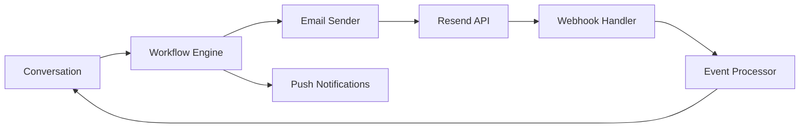

Cossistant provides powerful integrations that enable seamless communication between your application and customers. These integrations work together to create a unified messaging experience across multiple channels.

## Available Integrations

Cossistant currently supports the following integration types:

<CardGroup cols={2}>
  <Card title="Email Integration" icon="envelope" href="/integrations/email">
    Send and receive emails with threading support and bounce management
  </Card>
  <Card title="Webhooks" icon="webhook" href="/integrations/webhooks">
    Receive real-time notifications about email events and conversation updates
  </Card>
</CardGroup>

## Integration Architecture

All Cossistant integrations are built on a robust, event-driven architecture:



### Core Components

<AccordionGroup>
  <Accordion title="Workflow Engine">
    The workflow engine orchestrates all notification delivery based on conversation events. It handles:
    - Message routing to appropriate channels
    - Notification preference checking
    - Delay scheduling for batch notifications
    - Idempotency to prevent duplicate sends

    Workflows are triggered for:
    - `message/member-sent-message` - When a team member sends a message
    - `message/visitor-sent-message` - When a visitor/customer sends a message
    - `ai-agent/respond` - When the AI agent responds
  </Accordion>

  <Accordion title="Email Service">
    Powered by Resend, the email service provides:
    - Transactional email delivery
    - Email threading for conversation continuity
    - Bounce and complaint tracking
    - Inbound email processing for replies
  </Accordion>

  <Accordion title="Webhook System">
    The webhook system processes real-time events from Resend:
    - Email delivery status updates
    - Bounce and complaint notifications
    - Inbound email reception
    - Click and open tracking (optional)
  </Accordion>
</AccordionGroup>

## Email Threading

Cossistant implements sophisticated email threading to maintain conversation continuity across email clients:

<Steps>
  <Step title="Message-ID Generation">
    Each message gets a unique ID in the format: `<msg-{messageId}@cossistant.com>`
  </Step>
  
  <Step title="Conversation Threading">
    All emails in a conversation reference the same thread ID: `<conv-{conversationId}@cossistant.com>`
  </Step>
  
  <Step title="Reply Routing">
    Emails use specialized reply-to addresses that encode the conversation ID:
    - Production: `conv-{conversationId}@inbound.cossistant.com`
    - Development: `test-conv-{conversationId}@inbound.cossistant.com`
  </Step>
  
  <Step title="Header Configuration">
    Threading headers ensure proper grouping in email clients:
    - `In-Reply-To`: Points to the conversation thread ID
    - `References`: Maintains the complete thread chain
    - `Message-ID`: Unique identifier for each email
  </Step>
</Steps>

<Info>
Email threading is automatically handled by the `generateThreadingHeaders()` utility. You don't need to manually configure these headers when sending emails.
</Info>

## Notification Channels

Cossistant supports multiple notification channels that can be configured per user:

| Channel | Description | Configuration |
|---------|-------------|---------------|
| Email | Transactional emails via Resend | Per-member preference |
| Browser Push | Web push notifications | Requires user subscription |
| In-App | Real-time updates in the dashboard | Always enabled |

### Member Preferences

Team members can configure their notification preferences for:
- Email notifications (with delay settings)
- Browser push notifications
- Per-conversation overrides

### Visitor Notifications

Visitors automatically receive email notifications when:
- A team member replies to their message
- An AI agent provides a response
- Their conversation is escalated to a human

<Warning>
Emails to visitors and team members are automatically suppressed if the recipient's email has bounced, been marked as spam, or failed repeatedly. This protects your sender reputation.
</Warning>

## Idempotency

All email sends use idempotency keys to prevent duplicate messages:

```typescript
const idempotencyKey = generateEmailIdempotencyKey({
  conversationId: "01ABCD1234EFGH5678IJKL9012",
  recipientEmail: "user@example.com",
  timestamp: 1234567890000
});
// Result: "conv-01ABCD1234EFGH5678IJKL9012-12345-1234567890000"
```

The idempotency key format: `conv-{conversationId}-{emailHash}-{timestamp}`

This ensures that:
- Workflow retries don't send duplicate emails
- The same message isn't sent twice to the same recipient
- Email delivery is reliable even during failures

## Environment Isolation

Cossistant automatically isolates development and production environments:

- **Production**: Uses standard email addresses and webhook endpoints
- **Development**: Prefixes all addresses with `test-` to prevent crosstalk

Webhook handlers verify the environment before processing events:

```typescript
const isProdEnv = env.NODE_ENV === "production";
const isInboundProd = parsed.environment === "production";

if (isProdEnv !== isInboundProd) {
  // Skip processing - environment mismatch
  return;
}
```

## Error Handling

Cossistant implements comprehensive error handling:

<AccordionGroup>
  <Accordion title="Email Bounces">
    Permanent bounces automatically suppress future emails to that address. Transient bounces are logged but don't prevent retries.
  </Accordion>

  <Accordion title="Spam Complaints">
    Any spam complaint immediately suppresses all future emails to that address across all conversations.
  </Accordion>

  <Accordion title="Delivery Failures">
    After 3 consecutive failures to the same email address, it's automatically suppressed to protect sender reputation.
  </Accordion>

  <Accordion title="Webhook Verification">
    All webhooks are verified using Svix signatures to prevent unauthorized requests.
  </Accordion>
</AccordionGroup>

## Next Steps

<CardGroup cols={2}>
  <Card title="Email Integration" icon="envelope" href="/integrations/email">
    Learn how to configure email sending and threading
  </Card>
  <Card title="Webhook Configuration" icon="webhook" href="/integrations/webhooks">
    Set up webhook endpoints to receive real-time events
  </Card>
</CardGroup>
